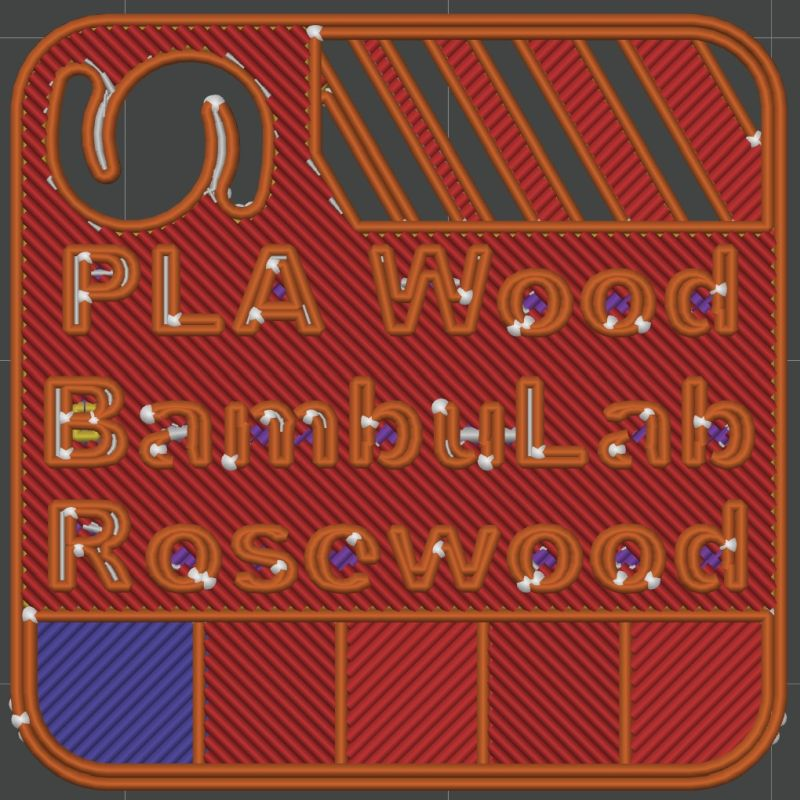
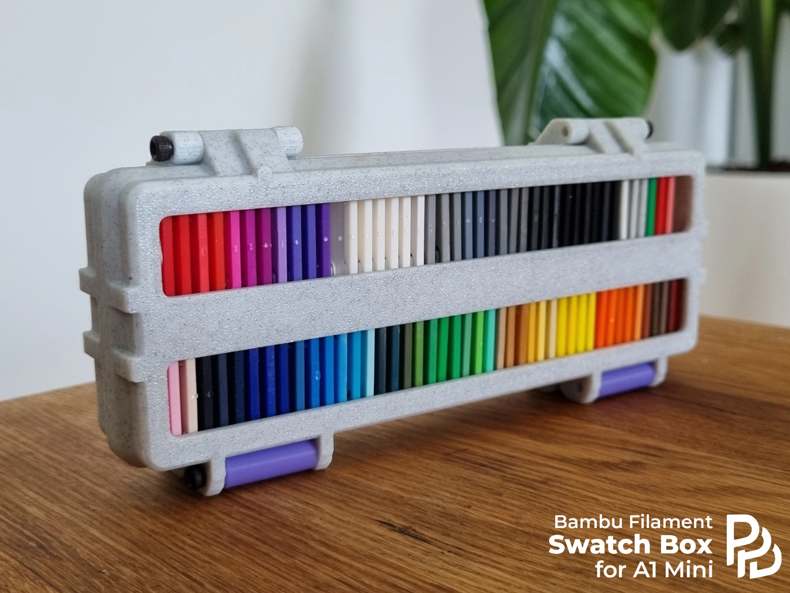

# FilamentSwatches
**Collection of filament swatches**
An attempt to create a nice collection of filament swatches for different materials, colors, producers/brands.
the naming convention is easy:
**Material [variant] - Brand - Color**
The info is easily editable in the model too so you can create other variants. 

## Handy case for swatches

[Link to the model](https://pages.github.com/)

